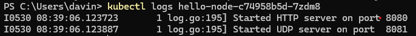
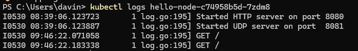
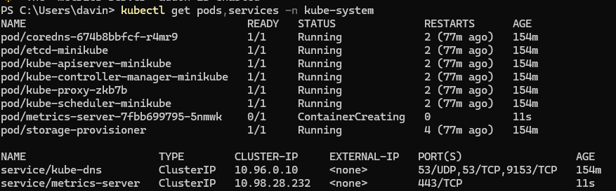

# Reflection on Hello Minikube

### Application logs before vs. after exposing as a Service

Before running the expose for the service it will only show the ports and not any HTTP requests as shown here,



After exposing the pod and open its URL through the use of the minikube service. Every time a HTTP GET is made it generates a new log line in the Pod stdout results. So for every time the URL is hit it will generate another entry and this increments in the log for every HTTP GET made. As shown here



### Purpose of -n kube-system vs. no -n

By default, kubectl get pods or kubectl get services uses the default. All objects live in that default namespace, so they appear under a plain kubectl get however if the -n kube-system tells the kubectl to list objects in the kube-system namespace and not the default. This shows the core add-ons and etc. This is why items like hello-node do not show up because they were not created in the system namespace.



# Reflection on Rolling Updates

### Difference between Rolling Update and Recreate
RollingUpdate creates new Pods before terminating old ones, maintaining minimal capacity throughout the process. Each new Pod must pass  checks before the old one is removed, enabling zero-downtime upgrades and easy rollbacks for the different pods.

Recreate shuts down all existing Pods first, then starts the new ones. This saves resources but causes a brief service interruption between teardown and startup. The implementation of both depends on the scenario of the system and we must always evaluate the trade off before executing either.

### Deploying with Recreate strategy

To change it I change the strategy type to 'Recreate' and then I applied it to the pods with kubectl apply -f. I observed that all old Pods terminated first (0 READY), the Service returned 503 during that window, then the new Pods appeared and then the service resumed to work as before.

```
strategy:
   type: Recreate
   ```

Above was the main change i made.

### The benefits of using Kubernetes manifest files

__Declarative & version-controlled__:  Store the desired state in Git, review changes, and roll back easily. This means that incase of errors or the need to revert changes it becomes very easy to manage and apply

__Repeatable__: The same kubectl apply -f works on any cluster or namespace without remembering long commands meaning that it is a very useful command to understand. This is especially true when handling deployment.

__Auditable__: The manifests can be defined as the documentation of the specific fields that were set meaning that it can be easily checked and verified in the case of debugging or troubleshooting.

__Scalable__: In the situation where the setup grows to dozens of elements such as Deployments, Services, ConfigMaps, etc. The method of managing them via YAML in directories is far more maintainable meaning that it is very scaling friendly.